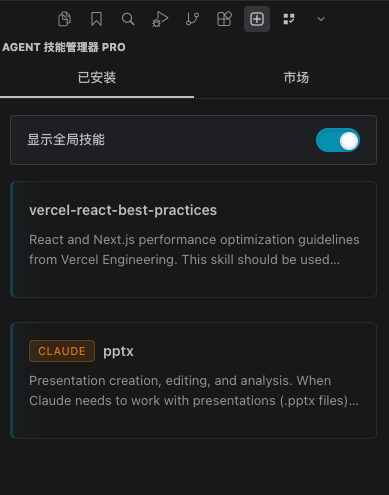
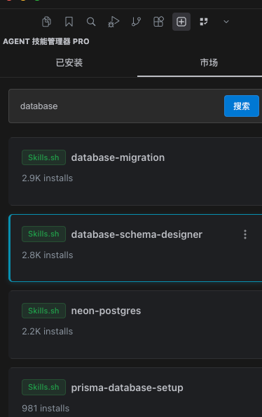
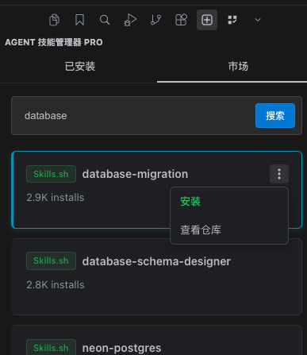
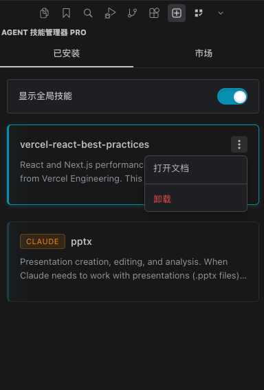
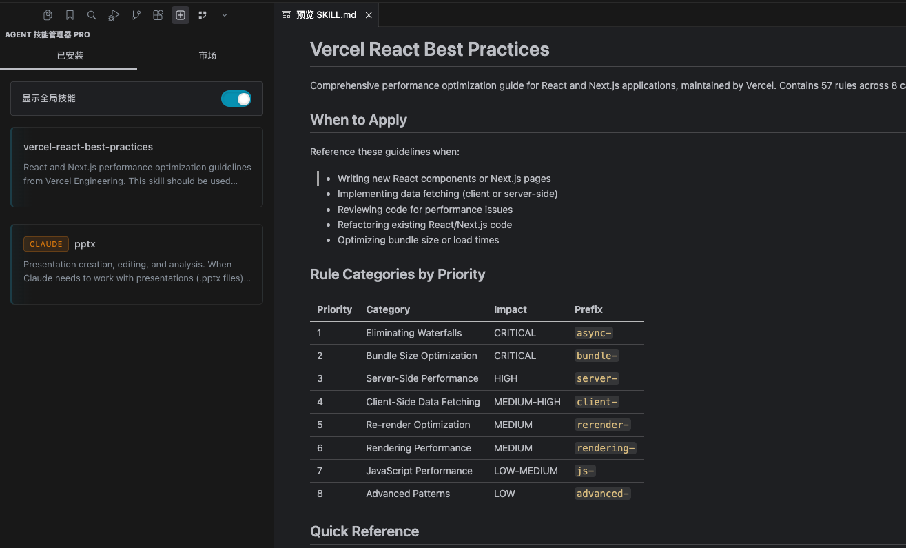

# Agent Skills Manager Pro

[中文文档](./README.zh-CN.md)

Manage and operate AI agent skills directly inside VS Code and VS Code-based IDEs (including Cursor).

## Features

- Discover skills from remote marketplaces.
- Install, update, and remove skills from a sidebar workflow.
- Support multiple agent ecosystems (for example Claude Code, Cursor, Cline).
- Open `SKILL.md` in the IDE Markdown viewer/editor.
- Cache remote `SKILL.md` files for faster detail loading.

## Requirements

- VS Code `1.80.0+` or compatible VS Code-based IDE.
- Git available in your system `PATH` for repository-based skill operations.

## Installation

### Marketplace

Install **Agent Skills Manager Pro** from the VS Code Marketplace.

### VSIX

1. Download the `.vsix` artifact.
2. Run `Extensions: Install from VSIX...`.
3. Select the downloaded file.

## Quick Start

1. Open the **Skills** view from the Activity Bar.
2. In **Marketplace**, search for a skill and install it.
3. In **Installed**, click a skill card to open its `SKILL.md`.

## Screenshots

### Sidebar Overview


### Marketplace Search


### Skill Card Actions


### Installed Tab


### Skill Detail


## Configuration

| Setting | Description | Default |
| --- | --- | --- |
| `skills.apiUrls` | Marketplace base URL(s) without path. The extension appends fixed API paths (for example `/api/search`, `/api/skills/all-time/{page}`). | `[{ "url": "https://skills.sh", "enabled": true, "name": "Skills.sh", "priority": 100 }]` |
| `skills.defaultAgents` | Default target agents for install operations. | `["claude-code"]` |
| `skills.defaultScope` | Default install scope. | `"global"` |
| `skills.cacheMaxSize` | Max local cache size (MB) for downloaded docs. | `50` |
| `skills.cacheExpiryDays` | Cache expiry days for downloaded docs. | `7` |
| `skills.skipInstallPrompts` | Install directly with defaults without prompt flow. | `false` |

## API Documentation

- Marketplace API spec: [docs/api/api.md](./docs/api/api.md)

## Commands

- `Skills: Refresh`
- `Skills: Search Marketplace`
- `Skills: Install from URL...`
- `Skills: Clear Cache`

## Localization

- Extension contribution points are localized with `package.nls.json` and `package.nls.zh-cn.json`.
- Webview UI supports English and Simplified Chinese based on IDE display language.

## Development

```bash
npm install
npm run compile
npm run build-webview
```

For packaging:

```bash
npm run vscode:prepublish
```

## Repository

- Source: [github.com/yidayoung/skills-vs-code](https://github.com/yidayoung/skills-vs-code)
- Issues: [github.com/yidayoung/skills-vs-code/issues](https://github.com/yidayoung/skills-vs-code/issues)

## License

MIT
